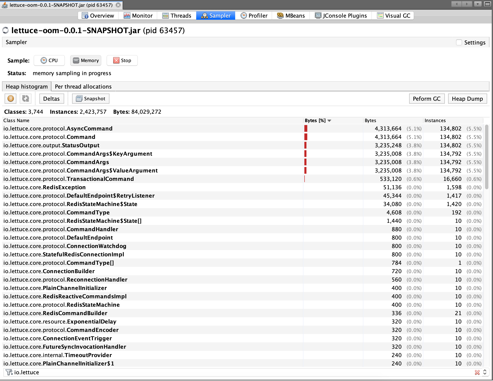
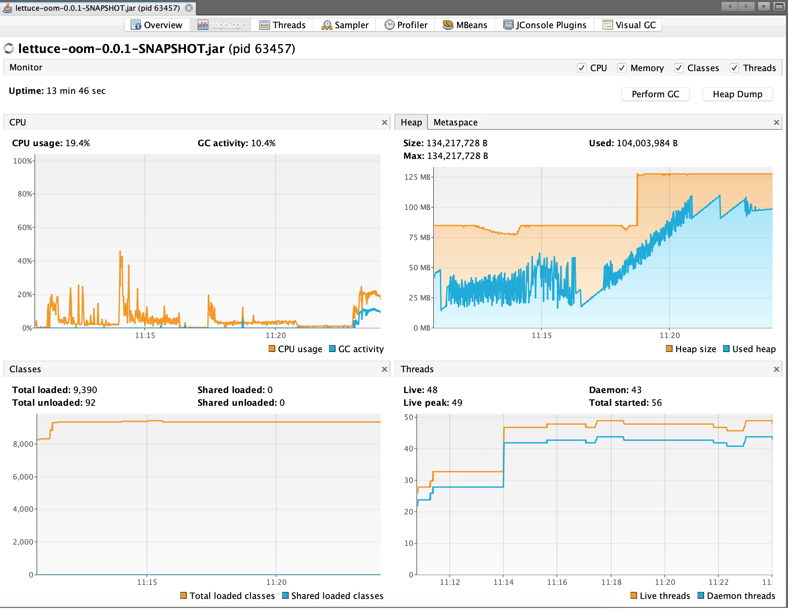

# A simple Spring Boot application to demonstrate memory leak in Lettuce when Redis is down

## Steps for running

- Run Redis container

    `docker run --name redis -d -p 6379:6379 redis`
    
- Assemble Spring Boot app
    
    `./gradlew clean assemble`
    
- Run Spring Boot app
    
    `java -Xms64m -Xmx128m -XX:ParallelGCThreads=2 -Djava.rmi.server.hostname=localhost -jar build/libs/lettuce-oom-0.0.1-SNAPSHOT.jar`
    
- Run ApacheBench or JMeter

    `ab -t 900 http://localhost:8080/ping`
    
- Open jVisualVM, start memory sampling and observe classes under the `io.lettuce` package. At this stage, the number of
classes should be going up and down as they're garbage collected by the JVM with nothing unusual happening.

- Stop Redis

    `docker stop redis`
    
- Observe how the number of command classes suddenly starts creeping up. Manually triggering GC has no effect. This eventually
would lead to the JVM crashing with an OOM. (We might have to restart the ApacheBench session a few times for this).

    

- Start Redis

    `docker start redis`
    
- After a few seconds, the requests will start to succeed again as connection to Redis is reestablished. However, the number of 
queued up commands seen on jVisualVM do not seem to reduce. This way, if Redis were to go down in a production system a few times
during the day, a number of commands eventually accumulate on the JVM leading to an OOM and eventually a crash.

    ```
    2020-05-20 11:26:13.317  INFO 63457 --- [nio-8080-exec-1] com.adarshr.lettuce.oom.RedisService     : Pinging Redis
    Exception in thread "Catalina-utility-1" Exception in thread "RMI TCP Connection(idle)" java.lang.OutOfMemoryError: GC overhead limit exceeded
    java.lang.OutOfMemoryError: GC overhead limit exceeded
    Exception in thread "Atomikos:1"
    Exception: java.lang.OutOfMemoryError thrown from the UncaughtExceptionHandler in thread "Atomikos:1"
    
    Exception: java.lang.OutOfMemoryError thrown from the UncaughtExceptionHandler in thread "RMI TCP Connection(idle)"
    Exception in thread "Atomikos:2" java.lang.OutOfMemoryError: GC overhead limit exceeded
    Exception in thread "http-nio-8080-exec-1" java.lang.OutOfMemoryError: GC overhead limit exceeded
    Exception in thread "RMI TCP Connection(idle)" java.lang.OutOfMemoryError: GC overhead limit exceeded
    Exception in thread "RMI TCP Connection(idle)" java.lang.OutOfMemoryError: GC overhead limit exceeded
    Exception in thread "RMI TCP Connection(idle)" java.lang.OutOfMemoryError: GC overhead limit exceeded
    Exception in thread "RMI TCP Connection(idle)" java.lang.OutOfMemoryError: GC overhead limit exceeded
    Exception in thread "RMI TCP Connection(idle)" java.lang.OutOfMemoryError: GC overhead limit exceeded
    Exception in thread "RMI TCP Connection(idle)" java.lang.OutOfMemoryError: GC overhead limit exceeded
    Exception in thread "RMI TCP Connection(idle)" java.lang.OutOfMemoryError: GC overhead limit exceeded
    Exception in thread "RMI TCP Connection(idle)" java.lang.OutOfMemoryError: GC overhead limit exceeded
    Exception in thread "RMI TCP Connection(idle)" java.lang.OutOfMemoryError: GC overhead limit exceeded
    Exception in thread "RMI TCP Connection(idle)" java.lang.OutOfMemoryError: GC overhead limit exceeded
    Exception in thread "RMI TCP Connection(idle)" java.lang.OutOfMemoryError: GC overhead limit exceeded
    ```
  
    